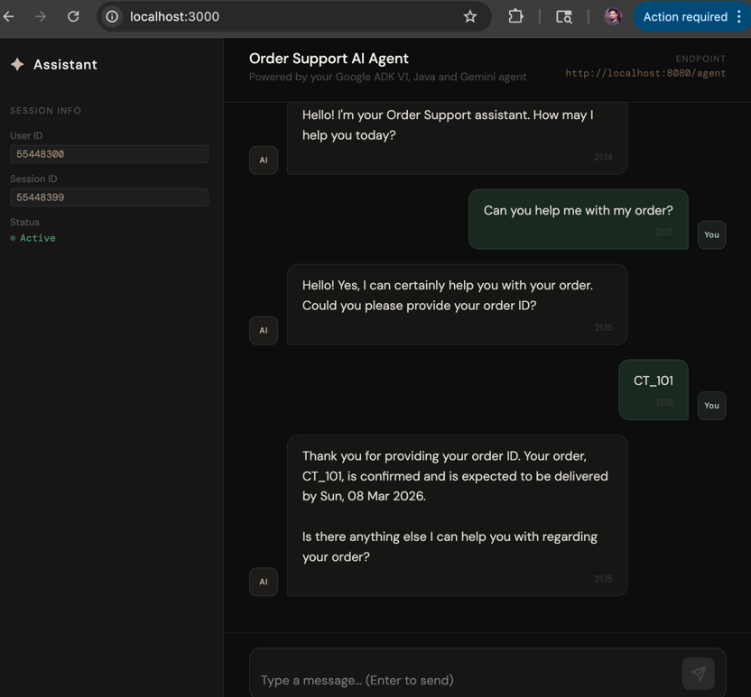
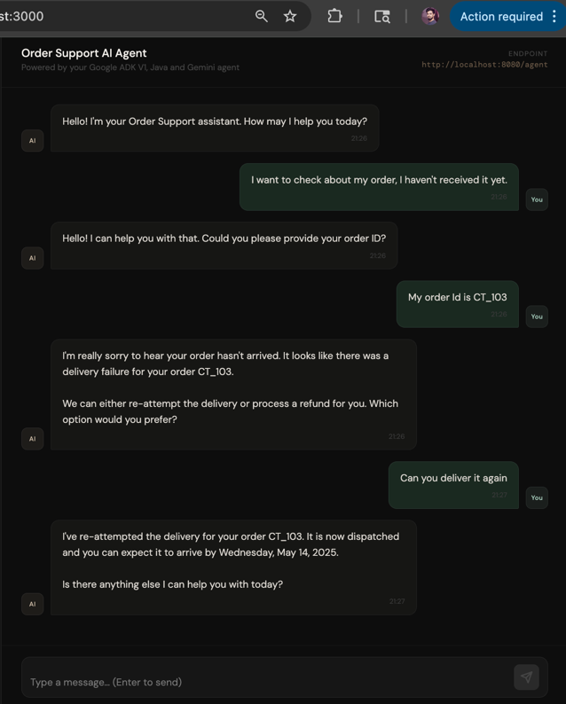
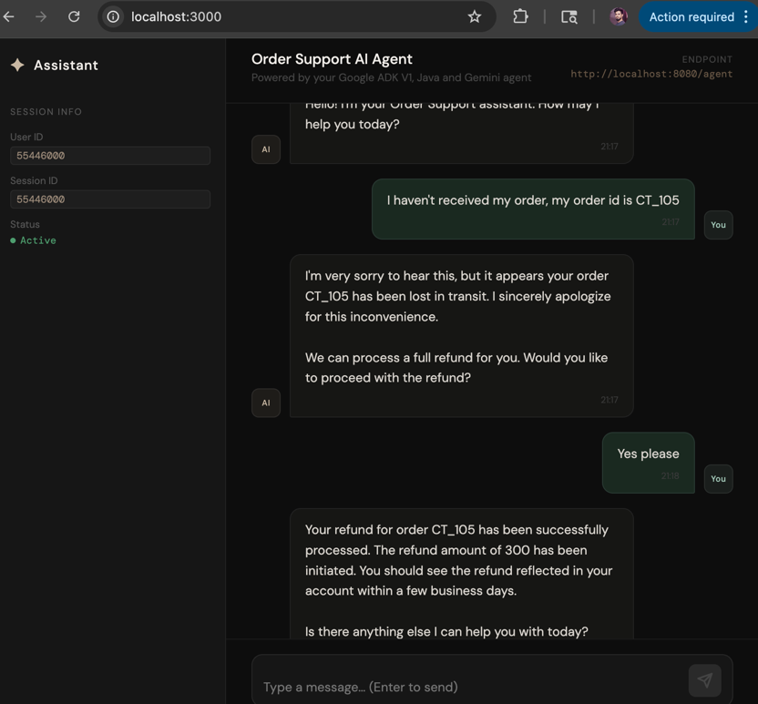

# Agentic Order Support

Agentic Order support powered by Google ADK & Gemini, built with Java 26.

### Introduction
Scenario:
Orders are actively progressing through various stages of their lifecycle. This agentic customer support system goes beyond basic order tracking, it intelligently understands user queries, diagnoses critical issues, and takes decisive actions to resolve them. By combining real-time insights with autonomous intervention capabilities, it ensures not just visibility, but end-to-end resolution and a seamless customer experience.

This is a **Single Agent, Multi-Capability Agentic AI** system with following capabilities:
- Act as a custom support executive and interact with customers in a polite and professional manner
- Retrieves and provides order status to Customers
- In case of issues with order delivery, offers customers multiple resolution options
- Initiates re-delivery attempts upon customer request
- Processes refunds if the order cannot be fulfilled or if the customer chooses to cancel

### In action:

#### Checking Order Status:



#### Handling Recoverable Order Failure, and try delivery again



#### Handling Uncoverable Order Failure, and process refund



### Setup and Run the agent as spring Boot application

- Setup Gemini key in the sprint boot application's environment variable section:
- > GEMINI_API_KEY=<your_gemini_api_key>
- Note: No need to write "export" also don't use the key under quotes

There are two ways to run the agent:
- via the command-line:
  mvn compile exec:java -Dexec.mainClass=com.ct.orderagent.AgentCliRunner
- Or the ADK Dev UI:
  mvn compile exec:java \
  -Dexec.mainClass="com.google.adk.web.AdkWebServer" \
  -Dexec.classpathScope="compile"

#### Simple run instruction:
- Go to the project directory
- run spring boot application with GEMINI KEY as environment variable (use way to injecting GOOGLE_API_KEY)
- > GOOGLE_API_KEY=your_google_api_key mvn spring-boot:run

- **Agent's inference API will be available at localhost:8080/agent**

#### Agent Inference API

- This is a sample curl command for the inference:
- > curl --location 'localhost:8080/agent' \
  --header 'Content-Type: application/json' \
  --data '{
  "userId": "550e8400-e29b-41d4-a716-446655440001",
  "sessionId": "660e8400-e29b-41d4-a716-446655440011",
  "input": "Where is my Order"
  }'
  
- This is a sample response from the Agent:
- > {
  "userId": "550e8400-e29b-41d4-a716-446655440001",
  "sessionId": "660e8400-e29b-41d4-a716-446655440011",
  "response": "Function Call: FunctionCall{id=Optional[adk-04aff674-0189-47cd-be7e-bb9c6276c5b4], args=Optional[{orderId=X_123}], name=Optional[checkOrderStatus], partialArgs=Optional.empty, willContinue=Optional.empty}Function Response: FunctionResponse{willContinue=Optional.empty, scheduling=Optional.empty, parts=Optional.empty, id=Optional[adk-04aff674-0189-47cd-be7e-bb9c6276c5b4], name=Optional[checkOrderStatus], response=Optional[{status=CONFIRMED}]}Your order X_123 has been confirmed. Is there anything else I can help you with today?"
  }


### UI Setup and Run 
Run with Docker (recommended)
- move to ui directory
- > cd agentic-order-support-ui
- run using docker compose

```bash
# Build and run on port 3000
docker compose up --build

# With a custom backend URL
REACT_APP_BASE_URL=http://<agent-inference-url>:8080 docker compose up --build
e.g.
REACT_APP_BASE_URL=http://localhost:8080 docker compose up --build
```

Visit: http://localhost:3000