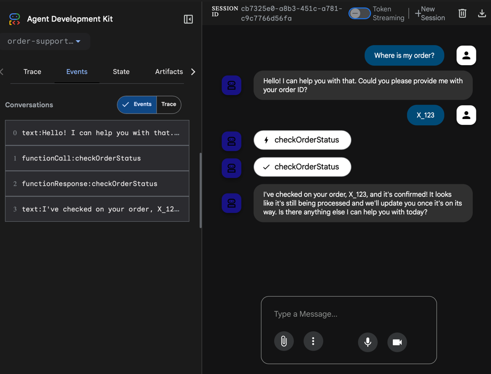
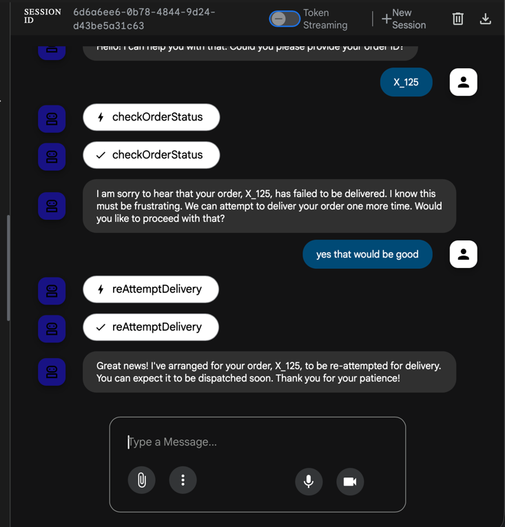
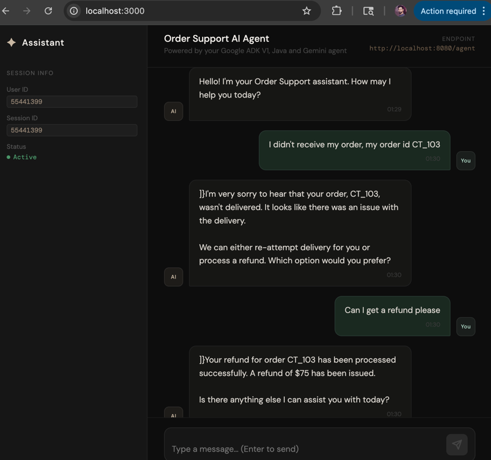

# Agentic Order Support

Agentic Order support powered by Google ADK & Gemini, built with Java 21.

### Demo

Scenario: where the orders have places and are in different stages of the journey.
This is an Agentic Custom Support system, capable enough to handle user queries regarding the orders and take appropriate actions to support the customer.

This system has following capabilities:
- Interact with the customer in a polite professional way
- Check order status for the user
- In case of any problem with the order delivery, the agent can help customer with multiple options
- Can initiate a re-delivery attempt if the customer wants
- Can initiate a refund if the order can't be restored or if the customer wishes to do so.

### In action:

### Setup

- Setup Gemini key in the sprint boot application's environment variable section:
- > GEMINI_API_KEY=<your_gemini_api_key>
- Note: No need to write "export" also don't use the key under quotes

### Run
There are two ways to run the agent:
- via the command-line:
mvn compile exec:java -Dexec.mainClass=com.ct.orderagent.AgentCliRunner
- Or the ADK Dev UI:
mvn compile exec:java \
-Dexec.mainClass="com.google.adk.web.AdkWebServer" \
-Dexec.classpathScope="compile"